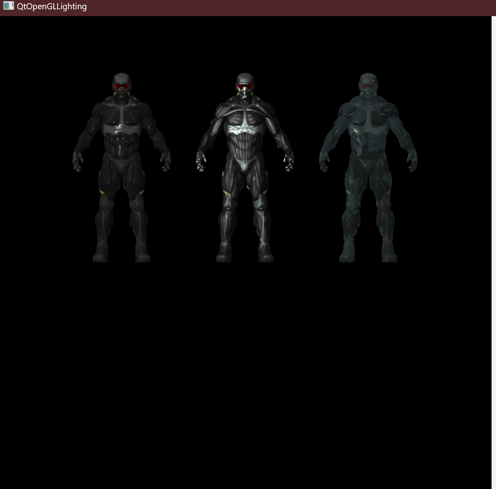

# 图形学作业二
王展鹏 2020010876
## 实验目的
1. 构建场景
2. 光源加载
3. 场景漫游
4. 场景配置
5. 光线追踪
## 实验方法
1. 构建场景
  - 天空盒：使用立方体贴图实现天空盒，移除位移，并将其深度设为最大
  - 多面数模型：使用Assimp库加载多面数模型，增加Mesh类和Model类，实现多面数模型的加载和渲染
  - 材质：实现了多种材质，包括漫反射、镜面反射、折射、透明度等不同配置
2. 光源加载
 - 使用光源盒实现Phong光照模型
 - 实现了光源的移动和颜色变化
3. 场景漫游
  - 使用鼠标拖动实现视角旋转
  - 使用键盘WASD实现视角的上下左右移动
  - 使用键盘FB实现视角的前后移动
  - 使用键盘ZX实现视角的缩放
4. 场景配置
    - 使用json文件配置场景中的物体位置、大小、角度、颜色信息
    - 使用json文件配置光源信息，包括光源位置、颜色等
5. 光线追踪
    - 实现了光线追踪的基本框架
## 实验结果
1. 场景和移动光照


2. 配置文件示例

    ```json
    {
        "lightbox": {
            "color": [1.0, 1.0, 1.0],
            "size": 5,
            "speed": 0.2,
            "start": [0.0, 1.0, -2.0],
            "end": [10.0, 1.0, -2.0]
        },
        "models": [
            {
                "path": "./models/nanosuit/nanosuit.obj",
                "position": [0.0, -8.0, 3.0],
                "rotation": [180.0, 0.0, 1.0, 0.0],
                "scale": [1.0, 1.0, 1.0],
                "shininess": 1.0,
                "opacity": 1.0
            },
            {
                "path": "./models/nanosuit/nanosuit.obj",
                "position": [10.0, -8.0, 3.0],
                "rotation": [180.0, 0.0, 1.0, 0.0],
                "scale": [1.0, 1.0, 1.0],
                "shininess": 100.0,
                "opacity": 1.0
            },
            {
                "path": "./models/nanosuit/nanosuit.obj",
                "position": [-10.0, -8.0, 3.0],
                "rotation": [180.0, 0.0, 1.0, 0.0],
                "scale": [1.0, 1.0, 1.0],
                "shininess": 50.0,
                "opacity": 0.6
            }
        ]
    }
    ```
3. 光线追踪




## 编译环境
- Windows 11 23H2
- VScode 1.95.3 
  - Qt C++ Extension 1.0.0
  - CMake 3.29.2 Extension
- Qt 6.7.3 (MinGW 11.2.0 64-bit)

## 编译方式
- 使用VScode打开项目文件夹
- 使用Qt C++插件配置Qt版本
- 使用CMake插件配置编译环境
- 使用CMake工具编译项目

## 运行方式
- 进入exe文件夹
- 运行对应文件夹下的exe文件

## 参考资料
- [LearnOpenGL CN](https://learnopengl-cn.github.io/)